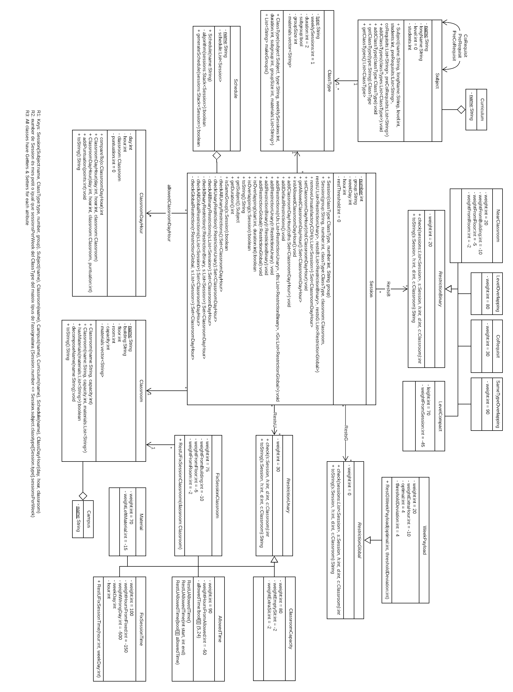
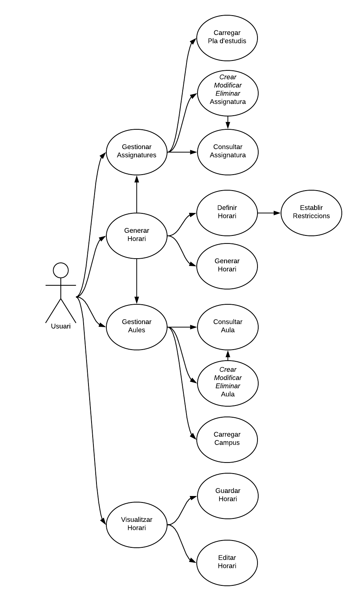

#  <sub style="font-size: 1.3em">Schedule Genie</sub>

------

Practica PROP 2018-2019, Generador d'Horaris. A partir de les assignatures, aules i restriccions introduïdes Schedule Genie crea un horari per a la universitat. Fet per Maurici Abad Gutierrez, Raul Main Nadal i Eric Martin Obispo.

## Com utilitzar Schedule Genie

Per utilitzar Schedule Genie només cal executar l'arxiu [ScheduleGenie.jar](ScheduleGenie.jar) que es troba a la carpeta arrel.

> Cal tenir java 8 instal·lat

Per consola se't demanarà que introdueixis un Curriculum <small>(Pla d'estudis)</small> i un Campus. Has de escriure el nom <small>(sense extensió) </small>d'un arxiu guardat dins la carpeta [data/curriculum/](`data/curriculum/`) i un de [data/campus/](data/campus/). Si vols crear assignatures o aules, per fer proves, només has de crear o modificar els .json de les carpetes de [data/](data/).

El següent paràmetre que cal entrar és el nom amb el qual es guardarà l'horari generat.

Llavors el programa generarà un horari amb totes les sessions i les restriccions predeterminades. Aquest horari és guardarà a [data/schedule/](data/schedule/) amb el nom introduït prèviament en format JSON.

Per visualitzar l'horari hem fet una pàgina web molt bàsica, es troba a [gui/index.html](gui/index.html). Per veure l'horari, senzillament has d'introduir el JSON generat a la web.

### Com compilar i executar

```bash
rm -rf exe/*
javac src/DrvCtrlDomain.java -d exe/ -cp src/
cd exe/ && jar cfe ../ScheduleGenie.jar DrvCtrlDomain . && cd ..
java -jar ScheduleGenie.jar
```

### Estructura de les carpetes

- **data**: conté els arxius que enmagatxemen la informació, és la "Base de Dades"
- **doc**: conté tota la documentació que hem fet.
- **drv**: conté els drivers en format .jar preparats per executar.
- **exe**: conté els arxius .class dels .java compilats
- **gui**: conté un senzill visualitzador d'horaris.
- **src**: conté el codi font.
  - **data**: conté els arxius de la capa de dades.
  - **domain**: conté els arxius de la capa de domini.
  - **presentation**: conté els arxius de la capa de presentació.
  - **org**: conté la llibreria org.json.

## Diagrama del model conceptual del domini


Explicat més a fons a: [Descripció del model conceptual del domini](doc/model.md) 

## Diagrama de casos d’ús


Explicat més a fons a: [Descripció dels casos d'ús](doc/uscases.md)


## Autors i distribució de les tasques

- **Abad Gutierrez, Maurici** - [maurici.abad@est.fib.upc.edu](mailto:maurici.abad@est.fib.upc.edu) 
  - Classes: `Session.java` + `CreateCshedule.java`
  - Restrictions: `RestGWeekPayload` + `RestUAllowedTime` + `RestUClassroomCapacity` + `RestUFixSessionClassroom` + `RestUFixSessionTime` + `RestUMaterial`
  - Controllers: `CtrlDB.java` + `CtrlDomain.java`
  - Altres: `JSONs` + `Bug Fixing` + `DrvCtrlDomain.java` + `Documentació en paper`

- **Main Nadal, Raul** - [raul.main@est.fib.upc.edu](mailto:raul.main@est.fib.upc.edu)
  - Classes: `Schedule.java` + `Aules.java` + `PlaEstudis.java` + `CtrlUI.java`
  - Restrictions: `RestBCoRequisit` + `RestBLevelOverlapping`
  - Drivers: `DrvSchedule` + `DrvBinaryRestrictions`
  - Altres: `JUnit`

- **Martin Obispo, Éric** - [eric.martin.obispo@est.fib.upc.edu](mailto:eric.martin.obispo@est.fib.upc.edu)
  - Classes: `Subject.java` + `ClassType.java` + `Classroom.java` + `PreviewSchedule.java`
  - Restrictions: `RestBNearClassroom` + `RestBLevelCompact`
  - Drivers: `All other Drivers`
  - Stubs: `All Stubs`
  
- **Entre tots**: 
  - Documentació: `Diagrama del model conceptual del domini` + `Diagrama dels casos d'ús`
